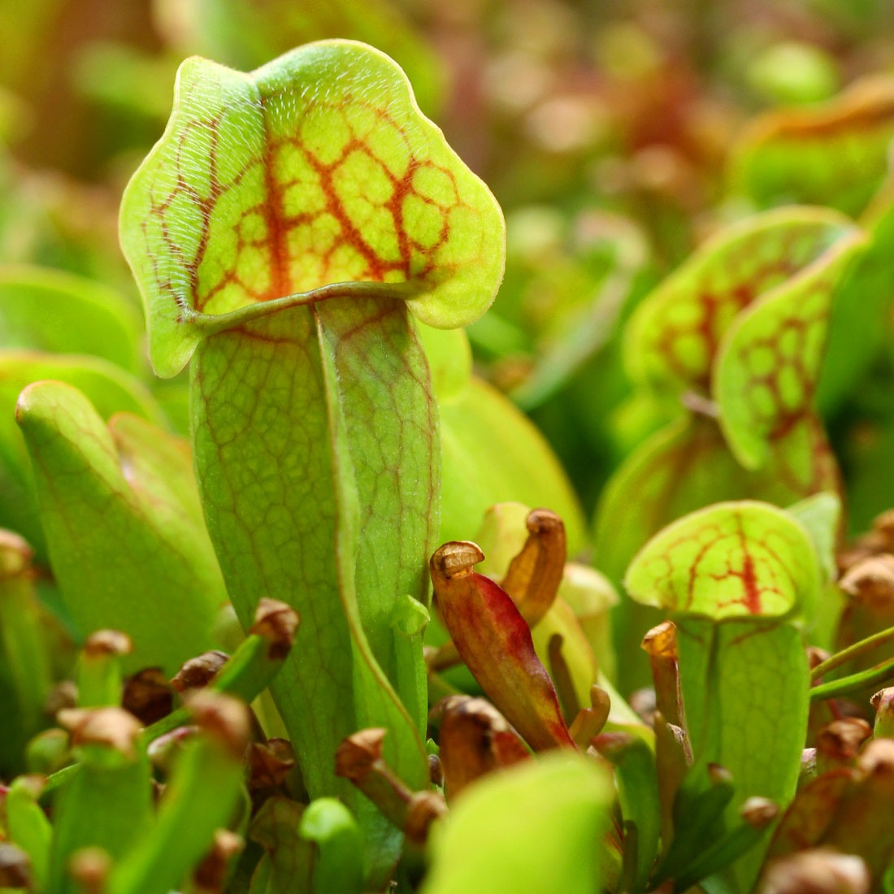
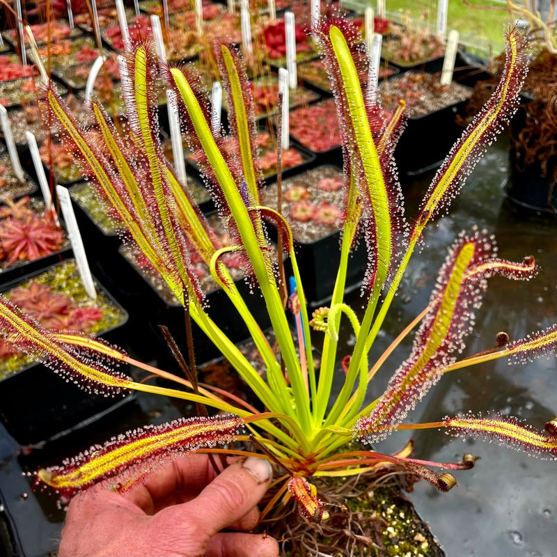
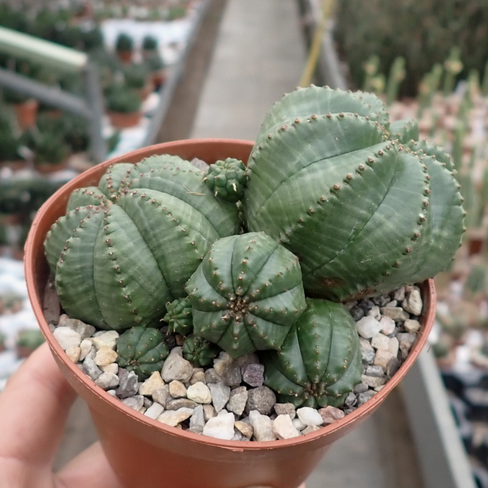

# Alpuerto-Kriscyrus_LW2_Plant_Species_Image_Classification

## A. Project Overview

### ● Brief Description of the Project

This project focuses on building a simple image classification model using pictures of plants that I personally collected. The images are used as a dataset and trained using Teachable Machine to help the AI recognize different plant categories.

The main goal of this project is to understand how image datasets work, how AI learns from images, and how training results such as accuracy and loss change during the learning process. This is part of my hands-on practice in machine learning and image classification.

### ● Purpose of the Image Classification Model

The purpose of this model is:

- To classify different plant images based on the dataset I created  
- To observe how AI learns through training (accuracy, loss, and predictions)  
- To gain basic experience with machine learning tools like Teachable Machine  

## B. Plant Species Overview

Below are the 20 plant species used in this image classification project. Each species includes one representative image and a short description.

---

### 1. Venus Flytrap

- Common Name: Venus flytrap 
- Scientific Name: Dionaea Muscipula  
- Description: The Venus flytrap (Dionaea muscipula) is a small, carnivorous perennial plant native to boggy, nutrient-poor soils in North/South Carolina. It features a rosette of hinged, jaw-like leaves that snap shut in less than a second to trap insects, triggered by sensitive hairs. The traps, often reddish inside with fringe-like cilia, digest prey to gain nutrients, reopening after 10 days. 

---

### 2. Winged Pitcher [lant

- Common Name: 
- Scientific Name: Nepenthes alata
- Description: Nepenthes alata, commonly known as the winged pitcher plant or Asian pitcher plant, is a carnivorous tropical vine endemic to the Philippines. It features,,green to red, pitcher-shaped leaves with distinct, wing-like ridges that trap insects. It is highly polymorphic, popular in cultivation, and thrives in high humidity and bright, indirect light. 

---

### 3. Purple Pitcher Plant

- Common Name: Purple Pitcher Plant
- Scientific Name: Sarracenia Purpurea 
- Description: Sarracenia purpurea, known commonly as the purple pitcher plant, northern pitcher plant, sidesaddle flower, or huntsman's cap, is a hardy, carnivorous perennial plant native to a wide range of North America, extending from the Gulf Coast to the Arctic Circle. It is famously used as the provincial flower of Newfoundland and Labrador in Canada. 

---

### 4. Albany Pitcher Plant

- Common Name: Albany Pitcher Plant,
- Scientific Name: Cephalotus Follicularis 
- Description: Cephalotus follicularis, commonly known as the Albany pitcher plant, Western Australian pitcher plant, or fly-catcher plant, is a small, carnivorous, perennial herbaceous plant endemic to the coastal swamps of southwestern Australia. It features small, moccasin-shaped pitfall traps (3–6 cm) with a striped, hairy lid to catch insects. 

---

### 5. Nodding Sun Pitcher

- Common Name: Nodding Sun Pitcher
- Scientific Name: Heliamphora Nutans
- Description: Heliamphora nutans is a species of carnivorous pitcher plant in the family Sarraceniaceae, commonly known as the Nodding Sun Pitcher or Marsh Pitcher Plant. It was the first Heliamphora species to be discovered and described (in 1840) and is native to the South American tepuis (table-top mountains) of Venezuela, Brazil, and Guyana. 

---

### 6. California Pitcher Plant. 

- Common Name: California Pitcher Plant. 
- Scientific Name: Darlingtonia Californica 
- Description: Darlingtonia californica is a unique, carnivorous, perennial plant native to Northern California and Oregon. It is best known by its common names, the Cobra Lily or California Pitcher Plant. 

---

### 7. Cape Sundew

- Common Name: Cape Sundew
- Scientific Name: Drosera Capensis
- Description: Drosera capensis, commonly known as the Cape Sundew, is a popular, easy-to-grow carnivorous perennial plant native to South Africa. It features long, strap-like leaves covered in glistening, sticky red tentacles that trap insects, usually growing up to 6 inches tall in rosettes. 

---

### 8. Mexican Butterwort

- Common Name: Mexican Butterwort
- Scientific Name: Pinguicula Moranensis
- Description: Pinguicula moranensis, commonly known as the Mexican Butterwort or Moran's Butterwort, is a carnivorous perennial herb from Mexico and Guatemala. It forms succulent, sticky,, often reddish-green rosettes that trap small insects like gnats and fruit flies, which it digests for nutrients. It produces vibrant purple or pink flowers and has distinct, succulent, non-carnivorous winter rosettes. 

---

### 9. Bladderwort

- Common Name: Bladderwort
- Scientific Name: Utricularia vulgaris
- Description: Utricularia vulgaris, commonly known as the common bladderwort or greater bladderwort, is a rootless, free-floating aquatic carnivorous plant. Found in ponds and marshes, it features finely divided leaves dotted with tiny bladder-like traps that capture small aquatic organisms. It produces yellow, snapdragon-like flowers on stalks above the water. 

---

### 10. Powdery-strap Bromeliad

- Common Name: Powdery-strap Bromeliad
- Scientific Name: Catopsis Berteroniana
- Description: Catopsis Berteroniana is a unique species of bromeliad, often referred to as a powdery-strap bromeliad, powdery strap airplant, or lantern of the forest. It is notable for being one of the few bromeliads considered to be partially carnivorous. 

---

### 11. Rainbow Plant

- Common Name: Rainbow Plant
- Scientific Name: Byblis liniflora
- Description: Byblis liniflora, commonly known as the Rainbow Plant, is a delicate, carnivorous plant native to northern Australia, Indonesia, and southern New Guinea. It is a member of the Byblidaceae family and is named for its ability to produce glistening, mucilage-covered leaves that sparkle in the sun. 

---

### 12. Portuguese Sundew

- Common Name: Portuguese Sundew
- Scientific Name: Drosophyllum lusitanicum
- Description: Drosophyllum lusitanicum, commonly known as the Portuguese Sundew or Dewy Pine, is a unique, perennial, carnivorous plant native to the western Mediterranean region (Portugal, Spain, and Morocco). It is the only species in the genus Drosophyllum and the family Drosophyllaceae. 

---

### 13. Sanderson's bladderwort

- Common Name: Sanderson's bladderwort
- Scientific Name: Utricularia sandersonii
- Description: Utricularia sandersonii is a popular species of carnivorous plant commonly known as Sanderson's bladderwort or, due to the unique shape of its flowers, the "rabbit ears" bladderwort. It is widely cultivated for its prolific, orchid-like blooms. 

---

### 14. Flycatcher Bush

- Common Name: Flycatcher Bush
- Scientific Name: Roridula gorgonias
- Description: Roridula gorgonias (Flycatcher Bush or Dewstick) is a South African, protocarnivorous, woody shrublet (up to 1m+) found in Cape Fynbos. It possesses sticky, resin-covered, narrow leaves that trap insects but cannot digest them directly, instead relying on a mutualistic relationship with Pameridea assassin bugs to process nutrients. 

---

### 15. Notched Sundew

- Common Name:  Notched Sundew
- Scientific Name: Drosera schizandra
- Description: Drosera schizandra is a rare, tropical, perennial carnivorous plant endemic to a single mountain range in Far North Queensland, Australia. It is a member of the "Three Sisters of Queensland" (or "Four Sisters" including D. buubugujin) along with D. adelae and D. prolifera, all of which are adapted to low-light, high-humidity rainforest understories. 

---

### 16. Cooper's Haworthia

- Common Name: Cooper's Haworthia
- Scientific Name: Haworthia cooperi
- Description: Haworthia cooperi is a small, slow-growing, clump-forming succulent native to South Africa, widely known as Cooper's Haworthia, Window Succulent, or Crystal Plant. It is characterized by translucent, fleshy, pale green or bluish-green leaves with "windows" on the tips that allow light to enter, and it produces small white flowers in spring to summer. 

---

### 17. Baseball Plant

- Common Name: Baseball Plant
- Scientific Name: Euphorbia obesa
- Description: Euphorbia obesa, commonly known as the baseball plant, living baseball, or sea urchin, is a rare, slow-growing, and spineless succulent from South Africa. It is highly prized for its perfectly spherical,, and later cylindrical, shape, featuring 8 ribs with mottled gray-green to purple-banded, plaid-like markings. 

---

### 18. Lotus Flower

- Common Name: Lotus Flower
- Scientific Name: Nelumbo nucifera
- Description: Nelumbo nucifera, commonly known as the sacred lotus, Indian lotus, or Chinese water lily, is an aquatic perennial plant native to Asia and Australia. It is characterized by large, fragrant, white or pink flowers, and massive, hydrophobic, parasol-like leaves that rise above the water. It is widely cultivated for its edible seeds, roots, and leaves, and holds significant cultural, religious, and medicinal value. 

---

### 19. Swiss cheese plant

- Common Name: Swiss cheese plant
- Scientific Name: Monstera deliciosa
- Description: Monstera deliciosa, commonly known as the Swiss cheese plant, split-leaf philodendron, or fruit salad plant, is a popular, fast-growing tropical vine from the Araceae family. It is characterized by large, glossy, deep green, heart-shaped leaves that develop dramatic holes (fenestrations) and slits as they mature. 

---

### 1. Passion Flower

- Common Name: Passion Flower
- Scientific Name: Passiflora
- Description: Passiflora, commonly known as passion flower or passion vine, is a genus of over 500 species of flowering plants, mostly tendril-climbing vines in the family Passifloraceae. They are recognized for their intricate, complex flowers, and many species produce edible fruits known as passion fruit (e.g., P. edulis) or granadilla. 

---
